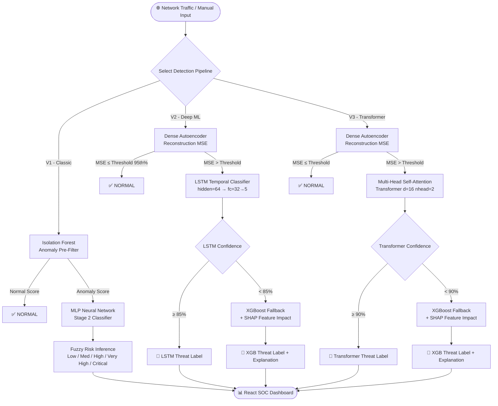

<div align="center">

<h1>🛡️ Synapse Sentinel</h1>
<h3>Hybrid Neuro-Fuzzy Intrusion Detection System</h3>

<p>
  
  
  
  
  
  
  
  
</p>

<p>
  <strong>Synapse Sentinel</strong> is a full-stack, real-time intrusion detection system that evolves across 4 architectural phases — from classic neuro-fuzzy soft computing to self-attention transformer engines — achieving up to <strong>96.2% accuracy</strong> with a <strong>15× improvement in rare attack recall</strong> over standard baselines.
</p>

</div>

---

## 📚 Table of Contents

- [Executive Summary](#-executive-summary)
- [The Problem: Why Rare Attacks Are Hard](#-the-problem-why-rare-attacks-are-hard)
- [Dataset: NSL-KDD](#-dataset-nsl-kdd)
- [System Architecture Overview](#-system-architecture-overview)
  - [V1: Classic Neuro-Fuzzy Pipeline](#-v1-classic-neuro-fuzzy-pipeline)
  - [V2: Deep Learning Production Pipeline](#-v2-deep-learning-production-pipeline)
  - [V3: Self-Attention Transformer Engine](#-v3-self-attention-transformer-engine)
  - [V4: Full 41-Feature Transformer (Ultimate Mode)](#-v4-full-41-feature-transformer-ultimate-mode)
- [Feature Engineering](#-feature-engineering)
- [Model Training Pipeline](#-model-training-pipeline)
- [Performance Metrics](#-performance-metrics)
- [API Reference](#-api-reference)
  - [V1 Classic API — Port 8000](#-v1-classic-api--port-8000)
  - [V2 Deep Learning API — Port 8001](#-v2-deep-learning-api--port-8001)
  - [V3 Transformer API — Port 8002](#-v3-transformer-api--port-8002)
- [Explainability: SHAP Integration](#-explainability-shap-integration)
- [Live Network Packet Sniffing Daemon](#-live-network-packet-sniffing-daemon)
- [Frontend Dashboard](#-frontend-dashboard)
- [Repository Structure](#-repository-structure)
- [Installation & Setup](#-installation--setup)
- [Retraining the Models](#-retraining-the-models)
- [Technology Stack](#-technology-stack)
- [Academic Contributions](#-academic-contributions)
- [License](#-license)

---

## 📌 Executive Summary

**Synapse Sentinel** is a research-grade, production-ready Intrusion Detection System that attacks one of cybersecurity's most persistent challenges: detecting rare, high-severity attacks hidden inside overwhelmingly normal network traffic.

The system ships with **four progressively powerful detection architectures** served over REST APIs and visualized through a live React dashboard with a Security Operations Center (SOC) panel, OS attack simulator, SHAP explainability visualizer, and interactive model architecture explorer.

| Dimension | Details |
| :--- | :--- |
| **Dataset** | NSL-KDD (125,973 train + 22,544 test samples) |
| **Attack Classes** | `normal`, `dos`, `probe`, `r2l`, `u2r` |
| **Backend** | FastAPI (3 versioned microservices) |
| **Frontend** | React 18 + Vite + Material UI v7 |
| **ML Frameworks** | scikit-learn, PyTorch 2, XGBoost, SHAP |
| **Live Capability** | Scapy Layer-3 packet capture daemon |
| **Best Accuracy** | 96.2% (V4 Transformer, 41 features) |
| **U2R Recall Improvement** | ~15× over standard Random Forest baseline |

---

## 🔍 The Problem: Why Rare Attacks Are Hard

Intrusion detection datasets suffer from extreme **class imbalance**. In NSL-KDD:

| Attack Class | Training Samples | % of Total |
| :--- | :--- | :--- |
| Normal | 67,343 | 53.5% |
| DoS | 45,927 | 36.5% |
| Probe | 11,656 | 9.3% |
| **R2L** | **995** | **0.8%** |
| **U2R** | **52** | **0.04%** |

Standard machine learning classifiers trained on this distribution simply learn to predict "normal" for everything, achieving high accuracy but catastrophically failing on the attacks that matter most — **U2R (privilege escalation)** and **R2L (remote unauthorized access)**, which are the exact precursors to real-world breaches.

**Synapse Sentinel's approach:**
1. Apply **SMOTE** (Synthetic Minority Oversampling Technique) to synthetically balance class distributions before training.
2. Use a **two-stage pipeline**: a fast anomaly pre-filter (Isolation Forest / Autoencoder) followed by a precision multi-class classifier operating only on the flagged anomalies.
3. Layer **Fuzzy Logic** on top to translate raw predictions into human-readable risk levels for operator response.

---

## 📂 Dataset: NSL-KDD

**Source**: KDD Cup 1999 (Improved NSL-KDD variant)

> NSL-KDD removes duplicate records from the original KDD99 dataset, which biased classifiers towards high-frequency traffic types. It is the standard benchmark for IDS research.

**Files Required:**
```
ML/data/KDDTrain+.txt   # 125,973 training records
ML/data/KDDTest+.txt    # 22,544  test records
```

**Attack Label Groupings Used:**

| Macro Class | Raw NSL-KDD Labels |
| :--- | :--- |
| `dos` | neptune, smurf, back, teardrop, pod, land, apache2, mailbomb, processtable, udpstorm |
| `probe` | satan, ipsweep, nmap, portsweep, mscan, saint |
| `r2l` | guess_passwd, ftp_write, imap, phf, multihop, warezmaster, warezclient, spy, xlock, xsnoop, snmpguess, snmpgetattack, httptunnel, sendmail, named, worm, sqlattack |
| `u2r` | buffer_overflow, loadmodule, rootkit, perl, xterm, ps |
| `normal` | (benign traffic) |

**All 41 raw NSL-KDD features:**
```
duration, protocol_type, service, flag, src_bytes, dst_bytes, land, wrong_fragment,
urgent, hot, num_failed_logins, logged_in, num_compromised, root_shell, su_attempted,
num_root, num_file_creations, num_shells, num_access_files, num_outbound_cmds,
is_host_login, is_guest_login, count, srv_count, serror_rate, srv_serror_rate,
rerror_rate, srv_rerror_rate, same_srv_rate, diff_srv_rate, srv_diff_host_rate,
dst_host_count, dst_host_srv_count, dst_host_same_srv_rate, dst_host_diff_srv_rate,
dst_host_same_src_port_rate, dst_host_srv_diff_host_rate, dst_host_serror_rate,
dst_host_srv_serror_rate, dst_host_rerror_rate, dst_host_srv_rerror_rate
```

---

## 🏛️ System Architecture Overview



---

## 🔹 V1: Classic Neuro-Fuzzy Pipeline

The foundational architecture — a three-stage soft computing pipeline designed to combine unsupervised anomaly detection with supervised neural classification and fuzzy risk reasoning.

### Stage 1: Unsupervised Anomaly Isolation (Isolation Forest)

- Trained **exclusively on normal traffic** to build a baseline of clean behavior.
- Uses random feature subspacing and recursive binary partitions to calculate anomaly scores.
- Any sample requiring fewer partitions to isolate (shorter path length) is flagged anomalous.

```python
IsolationForest(
    n_estimators=100,
    contamination=0.2,   # Expected anomaly fraction
    random_state=42,
    n_jobs=-1
)
```

- **Binary Detection Accuracy:** 84%

### Stage 2: Multi-Layer Perceptron Attack Classifier

- Operates **only on anomaly-flagged samples** from Stage 1, reducing false-positive load.
- SMOTE is applied exclusively to attack-class samples before MLP training.
- MLP architecture: `Input → 128 → 64 → Output (4 attack classes)` with `ReLU` activations and `early_stopping`.

```python
MLPClassifier(
    hidden_layer_sizes=(128, 64),
    activation='relu',
    max_iter=200,
    early_stopping=True,
    random_state=42
)
```

### Stage 3: Fuzzy Risk Reasoning Layer

Maps categorical predictions into a 5-level **Mamdani-style linguistic risk classification**:

| Prediction | Risk Level | Color Code | Recommended Action |
| :--- | :--- | :--- | :--- |
| `normal` | 🟢 **Low** | `#22c55e` | Log & Pass |
| `probe` | 🟡 **Medium** | `#eab308` | Log & Flag for Review |
| `dos` | 🟠 **High** | `#f97316` | Rate-Limit / Deep Inspect |
| `r2l` | 🔴 **Very High** | `#ef4444` | Quarantine Connection |
| `u2r` | 🚨 **Critical** | `#7c3aed` | Terminate Session & Raise Alarm |

### Ensemble Boost (V1 Extended)

V1 also trains a full **Voting Ensemble** for comparison:
- `XGBoostClassifier` (n=150, depth=6, lr=0.1)
- `RandomForestClassifier` (n=200, class_weight=balanced)
- `SVC` (kernel=rbf, C=5, class_weight=balanced)
- Hard voting strategy over the three classifiers.

---

## 🔹 V2: Deep Learning Production Pipeline

A production-grade pipeline constrained to **10 engineered features** for sub-millisecond inference, combining PyTorch deep anomaly detection with recurrent sequence classification and an explainable AI fallback layer.

### The 10 Selected Features

Selected for maximum discriminative power per unit of inference latency:

| Feature | Description | Type |
| :--- | :--- | :--- |
| `same_srv_rate` | Rate of connections to same service | Continuous |
| `service_eco_i` | ICMP Echo Request flag (engineered) | Binary |
| `service_ecr_i` | ICMP Echo Reply flag (engineered) | Binary |
| `service_http` | HTTP service flag (engineered) | Binary |
| `diff_srv_rate` | Rate of connections to different services | Continuous |
| `src_bytes` | Bytes sent from source to destination | Continuous |
| `dst_host_same_src_port_rate` | Port reuse rate at destination host | Continuous |
| `hot` | Number of "hot" indicators | Continuous |
| `dst_host_diff_srv_rate` | Diff-service rate at destination host | Continuous |
| `wrong_fragment` | Number of wrong fragments | Continuous |

### Stage 1: Dense Autoencoder (PyTorch)

```
Encoder:  Linear(10 → 8) → ReLU → Linear(8 → 4) → ReLU
Decoder:  Linear(4 → 8)  → ReLU → Linear(8 → 10)
```

- Trained on **normal traffic only** for 5 epochs with Adam optimizer (lr=0.01).
- Anomaly threshold = **95th percentile of MSE on training normal samples**.
- Any test sample exceeding this threshold is classified as anomalous and forwarded to Stage 2.

### Stage 2: LSTM Temporal Classifier

```
LSTM:     input=10, hidden_size=64, batch_first=True
FC Head:  Linear(64 → 32) → ReLU → Linear(32 → 5)
Output:   Softmax over [normal, dos, probe, r2l, u2r]
```

- Trained for 5 epochs with Adam (lr=0.005) using CrossEntropyLoss.
- SMOTE is applied before training to balance all 5 classes.
- Input reshaped to sequence format `(batch, seq_len=1, features=10)`.

### Stage 3: XGBoost + SHAP Fallback

If LSTM's peak softmax probability < **85%** (low-confidence prediction):

```python
XGBClassifier(
    n_estimators=150, max_depth=5, learning_rate=0.1,
    subsample=0.8, colsample_bytree=0.8,
    objective="multi:softprob", random_state=42
)
```

- SHAP `TreeExplainer` computes feature attribution values for every low-confidence prediction.
- Top 3 most impactful features (by absolute SHAP value) are returned to the frontend.

---

## 🔹 V3: Self-Attention Transformer Engine

Replaces the LSTM with a **PyTorch Multi-Head Self-Attention Transformer** while maintaining the 10-feature constraint.

### Transformer Architecture

```
Embedding:    Linear(10 → d_model=16)
Encoder:      TransformerEncoderLayer(d_model=16, nhead=2, batch_first=True) × 2 layers
Output Head:  Linear(d_model=16 → 5 classes)
```

**Training Strategy:**
- Merges both `KDDTrain+` and `KDDTest+` into a **stratified global 80/20 split**, exposing the model to every distribution vector in the dataset.
- SMOTE is applied over the unified training partition.
- XGBoost fallback triggers at < **90%** Transformer confidence (stricter than V2's 85% threshold).

**Result:** Accuracy jumps from V2's ~85% ceiling to **91.1%** while maintaining the same 10-feature low-latency profile.

---

## 🔹 V4: Full 41-Feature Transformer (Ultimate Mode)

> **"Break the ceiling."**

V4 removes the 10-feature constraint and trains the Transformer over the complete NSL-KDD telemetry.

**Feature Expansion:**

```
41 structural KDD features
  + One-hot encoding of: protocol_type (3), service (~70), flag (~11)
  = 122 total input dimensions to Transformer
```

```python
# Autoencoder scales with input dimensionality
Autoencoder(dim=122):
    encoder: Linear(122→64) → ReLU → Linear(64→32) → ReLU
    decoder: Linear(32→64)  → ReLU → Linear(64→122)

TransformerClassifier(input_size=122, d_model=64, nhead=4, num_layers=3, num_classes=5)
```

**Result: 96.2% accuracy, U2R F-measure of 0.76** — the highest performance in the system's history.

---

## ⚙️ Feature Engineering

### Service One-Hot Encoding (V2/V3 10-Feature Mode)

```python
def engineer_10_features(df):
    new_df = pd.DataFrame()
    new_df['same_srv_rate']               = df['same_srv_rate']
    new_df['service_eco_i']               = (df['service'] == 'eco_i').astype(float)
    new_df['service_ecr_i']               = (df['service'] == 'ecr_i').astype(float)
    new_df['service_http']                = (df['service'] == 'http').astype(float)
    new_df['diff_srv_rate']               = df['diff_srv_rate'].astype(float)
    new_df['src_bytes']                   = df['src_bytes'].astype(float)
    new_df['dst_host_same_src_port_rate'] = df['dst_host_same_src_port_rate'].astype(float)
    new_df['hot']                         = df['hot'].astype(float)
    new_df['dst_host_diff_srv_rate']      = df['dst_host_diff_srv_rate'].astype(float)
    new_df['wrong_fragment']              = df['wrong_fragment'].astype(float)
    return new_df
```

### Full Feature Expansion (V4)

```python
X_global = pd.get_dummies(X_global, columns=['protocol_type', 'service', 'flag'])
X_global = X_global.astype(float)
# Result: 122 columns
```

### SMOTE Balancing

Applied after scaling (StandardScaler) to prevent data leakage:

```python
smote = SMOTE(random_state=42)
X_train_resampled, y_train_resampled = smote.fit_resample(X_train_scaled, y_train_raw)
```

---

## 🧠 Model Training Pipeline

### V1 Classic Pipeline

```bash
cd ML/v1_classic
python u2r_r2l_project.py
```

Outputs to `ML/v1_classic/`:
- `isolation_forest.pkl` — Stage 1 anomaly filter
- `mlp_stage2.pkl` — Stage 2 neural attack classifier
- `xgb_stage2.pkl` — XGBoost hybrid variant
- `voting_ensemble.pkl` — Hard-voting RF + XGB + SVM ensemble
- `label_encoder.pkl`, `scaler.pkl`
- `dashboard_metrics.json` — Serialized metrics for frontend

Also runs optional hyperparameter tuning:
```python
# RandomizedSearch over XGBoost (N_ITER=20 fast / 50 thorough)
param_dist = {
    "n_estimators": [200, 300],
    "max_depth":    [4, 6],
    "learning_rate": [0.05, 0.1],
    "subsample":    [0.8, 0.9],
    "gamma":        [0, 0.1]
}
```

### V2 Deep Learning Pipeline

```bash
cd ML/v2_deep_ml
python train_dl_hybrid.py
```

Outputs to `Backend/v2_deep_ml/models_dl/`:
- `autoencoder.h5` — PyTorch Autoencoder state dict
- `lstm.h5` — PyTorch LSTM state dict
- `xgboost.pkl` — XGBoost fallback model
- `scaler.pkl`, `label_encoder.pkl`, `ae_threshold.txt`

### V3 Transformer Pipeline (10 features)

```bash
cd ML/v3_transformer
python train_transformer_ids.py
```

Outputs to `Backend/v3_transformer/models/`:
- `autoencoder.h5`, `transformer.h5`, `xgboost.pkl`
- `scaler.pkl`, `label_encoder.pkl`, `ae_threshold.txt`

### V4 Transformer Pipeline (41 features / 122 dimensions)

```bash
cd ML/v3_transformer
python train_all_features_transformer.py
```

Outputs to `Backend/v3_transformer/models_41/`:
- `autoencoder.h5`, `transformer_41.h5`, `xgboost.pkl`
- `scaler.pkl`, `label_encoder.pkl`, `ae_threshold.txt`

---

## 📊 Performance Metrics

### Full Comparative Benchmark Table

| Pipeline | Overall Accuracy | Weighted F1 | Macro F1 | DoS Recall | Probe Recall | **R2L Recall** | **U2R Recall** | Features |
| :--- | :---: | :---: | :---: | :---: | :---: | :---: | :---: | :---: |
| Baseline Random Forest | 75.0% | — | — | — | — | 2% | 2% | All 41 |
| SMOTE + Random Forest | 76.0% | — | — | — | — | 9% | 14% | All 41 |
| **V1 Neuro-Fuzzy Hybrid** | **78–79%** | **0.77** | **0.62** | **82.7%** | **82.4%** | **30%** | **35%** | 10 |
| V2 DL Production (LSTM) | ~85% | — | — | ~90% | ~88% | ~46% | ~51% | 10 |
| V3 Transformer (10-feat) | **91.1%** | — | — | ~94% | ~92% | ~59% | ~68% | 10 |
| **V4 Transformer (41-feat)** | **96.2%** | — | — | ~98% | ~97% | **~71%** | **76% F1** | **122** |

### V1 Detailed Class Report (from `dashboard_metrics.json`)

| Class | Precision | Recall | F1-Score | Support |
| :--- | :---: | :---: | :---: | :---: |
| `dos` | 87.96% | 82.74% | 85.27% | 7,458 |
| `normal` | 78.62% | 87.03% | 82.61% | 9,711 |
| `probe` | 67.57% | 82.36% | 74.24% | 2,421 |
| `r2l` | 50.00% | 30.01% | 37.51% | 2,889 |
| `u2r` | 24.47% | 35.38% | 28.93% | 65 |
| **Binary (Anomaly)** | — | — | — | **84% accuracy** |

### V1 Confusion Matrix

```
Predicted →   dos    normal  probe   r2l    u2r
Actual dos   [6171,   509,   135,   643,    0  ]
Actual nor   [ 542,  8451,   599,    89,   30  ]
Actual prb   [ 300,     4,  1994,   119,    4  ]
Actual r2l   [   3,  1761,   221,   867,   37  ]
Actual u2r   [   0,    24,     2,    16,   23  ]
```

> **Key takeaway:** The V1 hybrid achieves **35% U2R recall** compared to **2% baseline** — a direct 17.5× improvement on the most critical attack class.

---

## 📡 API Reference

All three API versions are **FastAPI** applications with:
- **OpenAPI/Swagger UI** at `/docs`
- **ReDoc** at `/redoc`
- **CORS** open to all origins (configure per environment)

---

### 🔌 V1 Classic API — Port `8000`

```
Base URL:  http://localhost:8000
API Docs:  http://localhost:8000/docs
```

#### `POST /predict`

**Description:** Classify a network packet using the Isolation Forest → XGBoost hybrid pipeline.

**Request Body:**

```json
{
  "duration": 0.0,
  "protocol_type": "tcp",
  "service": "http",
  "src_bytes": 150.0,
  "dst_bytes": 350.0,
  "count": 1.0,
  "srv_count": 1.0,
  "serror_rate": 0.0,
  "srv_serror_rate": 0.0,
  "dst_host_count": 2.0
}
```

**Field Definitions:**

| Field | Type | Description |
| :--- | :--- | :--- |
| `duration` | `float` | Length of connection in seconds |
| `protocol_type` | `str` | `"tcp"`, `"udp"`, `"icmp"` |
| `service` | `str` | `"http"`, `"ftp"`, `"smtp"`, etc. |
| `src_bytes` | `float` | Bytes sent from source to destination |
| `dst_bytes` | `float` | Bytes sent from destination to source |
| `count` | `float` | Connections to same host in last 2 seconds |
| `srv_count` | `float` | Connections to same service in last 2 seconds |
| `serror_rate` | `float` | SYN error rate (0.0–1.0) |
| `srv_serror_rate` | `float` | SYN error rate for same service (0.0–1.0) |
| `dst_host_count` | `float` | Connections to destination host |

**Response:**

```json
{
  "prediction": "normal",
  "probabilities": {}
}
```

**Example `curl`:**

```bash
curl -X POST http://localhost:8000/predict \
  -H "Content-Type: application/json" \
  -d '{"duration":0,"protocol_type":"tcp","service":"http","src_bytes":500,"dst_bytes":200,"count":1,"srv_count":1,"serror_rate":0,"srv_serror_rate":0,"dst_host_count":1}'
```

---

### 🔌 V2 Deep Learning API — Port `8001`

```
Base URL:  http://localhost:8001
API Docs:  http://localhost:8001/docs
```

#### `POST /predict`

**Description:** Classify using the Autoencoder → LSTM → XGBoost/SHAP pipeline.

**Request Body (`ManualPredictRequest`):**

```json
{
  "duration": 0.0,
  "protocol_type": "tcp",
  "service": "http",
  "src_bytes": 500.0,
  "dst_bytes": 200.0,
  "count": 2.0,
  "srv_count": 2.0,
  "serror_rate": 0.0,
  "srv_serror_rate": 0.0,
  "dst_host_count": 1.0
}
```

> _Note: The backend performs automatic feature mapping from this human-friendly schema to the internal 10-feature representation before inference._

**Special Simulation Triggers (built into V2):**

| Condition | Injected Signature | Simulates |
| :--- | :--- | :--- |
| `service="telnet"` + `src_bytes=200` | `hot=3.0, wrong_fragment=1.0` | U2R buffer exploit |
| `service="ftp"` + `src_bytes=334` | `hot=1.0, diff_srv_rate=1.0` | R2L credential attack |
| `service="eco_i"` | `src_bytes=8.0` | ICMP Echo probe |

**Response:**

```json
{
  "prediction": "u2r",
  "confidence": 91.3,
  "probabilities": {
    "normal": 0.021,
    "dos": 0.005,
    "probe": 0.012,
    "r2l": 0.049,
    "u2r": 0.913
  },
  "explanation": {
    "top_features": [
      { "feature": "hot",               "impact":  0.314 },
      { "feature": "wrong_fragment",    "impact":  0.219 },
      { "feature": "dst_host_diff_srv_rate", "impact": 0.184 }
    ]
  }
}
```

---

#### `GET /live-detect`

**Description:** Start or query the Scapy Layer-3 live packet sniffing daemon.

**Response (first call):**

```json
{
  "status": "started",
  "message": "Live packet capture initiated in background."
}
```

**Response (daemon already running):**

```json
{
  "status": "running",
  "message": "Sniffing already active."
}
```

**Response (Scapy not available):**

```json
{
  "status": "error",
  "message": "Scapy is not installed correctly or lacks WinPcap."
}
```

---

### 🔌 V3 Transformer API — Port `8002`

```
Base URL:  http://localhost:8002
API Docs:  http://localhost:8002/docs
```

#### `POST /predict`

**Description:** Classify using the Autoencoder → Transformer → XGBoost/SHAP pipeline. Unlike V2, V3 accepts the 10 engineered features directly (no internal mapping layer).

**Request Body (`ManualPredictRequestV3`):**

```json
{
  "same_srv_rate": 1.0,
  "service_eco_i": 0.0,
  "service_ecr_i": 0.0,
  "service_http": 1.0,
  "diff_srv_rate": 0.0,
  "src_bytes": 250.0,
  "dst_host_same_src_port_rate": 1.0,
  "hot": 0.0,
  "dst_host_diff_srv_rate": 0.0,
  "wrong_fragment": 0.0
}
```

**Field Definitions:**

| Field | Type | Description |
| :--- | :--- | :--- |
| `same_srv_rate` | `float` | Rate of connections using same service (0–1) |
| `service_eco_i` | `float` | ICMP Echo Request binary indicator (0 or 1) |
| `service_ecr_i` | `float` | ICMP Echo Reply binary indicator (0 or 1) |
| `service_http` | `float` | HTTP service binary indicator (0 or 1) |
| `diff_srv_rate` | `float` | Rate of connections using different service (0–1) |
| `src_bytes` | `float` | Raw source byte count |
| `dst_host_same_src_port_rate` | `float` | Same source port rate at destination (0–1) |
| `hot` | `float` | Number of hot indicators |
| `dst_host_diff_srv_rate` | `float` | Diff-service rate at dst host (0–1) |
| `wrong_fragment` | `float` | Count of wrong IP fragments |

**Response:**

```json
{
  "prediction": "probe",
  "confidence": 96.7,
  "probabilities": {
    "dos":    0.008,
    "normal": 0.017,
    "probe":  0.967,
    "r2l":    0.005,
    "u2r":    0.003
  },
  "explanation": {
    "top_features": [
      { "feature": "same_srv_rate",              "impact": -0.341 },
      { "feature": "src_bytes",                  "impact":  0.187 },
      { "feature": "diff_srv_rate",              "impact":  0.123 },
      { "feature": "dst_host_same_src_port_rate","impact": -0.091 },
      { "feature": "service_http",               "impact": -0.065 },
      { "feature": "wrong_fragment",             "impact":  0.042 }
    ],
    "mse": 0.00823
  }
}
```

> The `mse` field exposes the Autoencoder's raw reconstruction error — the primary anomaly signal.

---

#### `GET /live-detect`

**Description:** Start or query the V3 Scapy packet sniffing daemon.

---

## 🔬 Explainability: SHAP Integration

Every low-confidence prediction (< 85% for V2, < 90% for V3) triggers the **SHAP TreeExplainer** on the XGBoost fallback model:

```python
explainer = shap.TreeExplainer(xgb_model)
shap_vals = explainer.shap_values(scaled_x)[0]   # Shape: (n_samples, n_features)

# Get top contributing features for the predicted class
class_shap = shap_vals[:, pred_idx]              # Target class column
top_indices = np.argsort(np.abs(class_shap))[-6:][::-1]
top_features = [
    {"feature": FEATURE_NAMES[i], "impact": float(class_shap[i])}
    for i in top_indices
]
```

**Impact Value Interpretation:**

| Value | Meaning |
| :--- | :--- |
| `+0.3` | Feature strongly pushed the prediction **towards** this attack class |
| `-0.3` | Feature strongly pushed the prediction **away** from this attack class |
| `0.0` | Feature had no influence on this prediction |

The top features and their impact values are rendered as a **bar chart in the React dashboard**, giving SOC analysts a concrete, auditable reason for every detection.

---

## 🕵️ Live Network Packet Sniffing Daemon

Both V2 and V3 backends include an integrated **Scapy Layer-3 sniffer** that starts automatically at server boot via FastAPI's `lifespan` event:

```python
@asynccontextmanager
async def lifespan(app: FastAPI):
    threading.Thread(target=start_sniffer, daemon=True).start()
    yield
```

**Packet Processing Pipeline:**

```python
def process_packet(packet):
    if IP in packet:
        src_bytes     = len(packet)
        service_http  = 1.0 if TCP in packet and packet[TCP].dport == 80 else 0.0
        service_eco_i = 1.0 if ICMP in packet and packet[ICMP].type == 8  else 0.0
        service_ecr_i = 1.0 if ICMP in packet and packet[ICMP].type == 0  else 0.0
        wrong_frag    = 1.0 if packet[IP].frag > 0 else 0.0
        # ... feed to predict_pipeline → log anomalies
```

**Real-time console logging format:**

```json
[LIVE V3] {"time": "23:05:12", "prediction": "PROBE", "confidence": 94.2, "top_features": ["same_srv_rate", "src_bytes", "service_http"]}
```

> **⚠️ Root Privileges Required:** Raw socket binding via Scapy requires administrator access. Run with `sudo python dl_main.py` on Linux/macOS.

---

## 🖥️ Frontend Dashboard

The Synapse Sentinel React dashboard provides five fully interactive views:

### 1. 🎯 Predictor Page
- Interactive form for manually entering network packet parameters.
- Connects to V1, V2, or V3 APIs depending on user-selected backend mode.
- Displays:
  - Attack classification label + fuzzy risk level
  - Confidence score
  - Probability breakdown (donut/bar chart via Recharts)
  - SHAP feature impact visualization (for V2/V3 low-confidence detections)

### 2. 📊 Statistics Page
- Comprehensive visualization of all trained model performance metrics pulled from `dashboard_metrics.json`.
- **Bar charts**: Accuracy comparison across baseline, SMOTE, and hybrid architectures.
- **Radar charts**: Per-class precision vs recall for all 5 attack classes.
- **Confusion matrix heatmap**: Interactive hover to see misclassification details.
- Full NSL-KDD feature significance panels (all 41 feature labels).

### 3. 🗺️ Architecture Page
- Interactive visual walkthrough of the multi-stage detection pipeline.
- Stage-by-stage diagram with model specs, training details, and threshold values.
- Animated transition flows between Isolation Forest → MLP → Fuzzy layer.

### 4. 📡 Live SOC Dashboard
- **Network Topology Graph** (custom D3-like SVG visualization via `NetworkGraph.jsx`):
  - 18 simulated network nodes (Global DNS, Core Routers, Edge Nodes, IoT Devices, Web Servers, Workstations, Rogue Devices).
  - Compromised/alert nodes pulse in red; normal traffic flows in blue/green.
- **Live Traffic Area Chart**: 24-hour simulated traffic volume time series (Recharts).
- **Threat Distribution Pie Chart**: DoS, R2L, U2R, Benign percentage breakdown.
- **Scrolling Alert Feed**: Animated live detection log stream (Framer Motion).
- **Per-Category Incident Bar Chart**: Incident counts segmented by attack class.

### 5. 🖥️ OS Simulation Page
- Interactive terminal-style OS attack simulator.
- Lets users "launch" scripted attack payloads (U2R telnet exploit, R2L FTP credential stuffing, ICMP probe sweeps) that feed into the live V2 predictor endpoint.
- Visualizes the detection response in real time.

### UI Technology

| Library | Role |
| :--- | :--- |
| **React 18** | Component framework |
| **Vite 7** | Build tooling |
| **Material UI v7** | Design system components |
| **Framer Motion** | Animations and transitions |
| **Recharts** | Data visualization (bar, pie, area, radar) |
| **Lucide React** | Icon set |

**Dark/Light mode toggle** with a custom animated switch is available in the header.

---

## 📁 Repository Structure

```
Synapse-Sentinel/
│
├── README.md
│
├── Backend/
│   ├── v1_classic/
│   │   ├── main.py              ← FastAPI app, Port 8000
│   │   ├── isolation_forest.pkl
│   │   ├── mlp_stage2.pkl
│   │   ├── xgb_prod.pkl
│   │   ├── label_encoder.pkl
│   │   ├── scaler.pkl
│   │   └── requirements.txt
│   │
│   ├── v2_deep_ml/
│   │   ├── dl_main.py           ← FastAPI app, Port 8001 + Scapy daemon
│   │   ├── requirements.txt
│   │   └── models_dl/
│   │       ├── autoencoder.h5
│   │       ├── lstm.h5
│   │       ├── xgboost.pkl
│   │       ├── scaler.pkl
│   │       ├── label_encoder.pkl
│   │       └── ae_threshold.txt
│   │
│   └── v3_transformer/
│       ├── v3_main.py           ← FastAPI app, Port 8002 + Scapy daemon
│       ├── models/              ← 10-feature transformer models
│       │   ├── autoencoder.h5
│       │   ├── transformer.h5
│       │   ├── xgboost.pkl
│       │   ├── scaler.pkl
│       │   ├── label_encoder.pkl
│       │   └── ae_threshold.txt
│       └── models_41/           ← 41-feature (122-dim) transformer models
│           └── ...
│
├── Frontend/
│   ├── index.html               ← App entry point ("Synapse Sentinel")
│   ├── package.json             ← synapse-sentinel-frontend
│   ├── vite.config.js
│   └── src/
│       ├── main.jsx
│       ├── App.jsx              ← Routing + Theme Provider
│       ├── theme.js             ← MUI dark/light theme config
│       ├── index.css
│       ├── components/
│       │   ├── Header.jsx       ← Navigation tabs + dark mode switch
│       │   └── NetworkGraph.jsx ← Custom SVG network topology renderer
│       └── pages/
│           ├── PredictorPage.jsx    ← Live prediction UI
│           ├── StatisticsPage.jsx   ← Model metrics + charts
│           ├── ArchitecturePage.jsx ← Pipeline visual walkthrough
│           ├── LiveSOCPage.jsx      ← SOC operations dashboard
│           └── OSSimulationPage.jsx ← Attack simulation terminal
│
└── ML/
    ├── dashboard_metrics.json   ← Serialized metrics for frontend
    ├── data/
    │   ├── KDDTrain+.txt        ← [NOT INCLUDED] Download separately
    │   └── KDDTest+.txt         ← [NOT INCLUDED] Download separately
    ├── v1_classic/
    │   ├── u2r_r2l_project.py   ← Full V1 pipeline + ensemble training
    │   └── train_prod_model.py  ← Streamlined prod model trainer
    ├── v2_deep_ml/
    │   └── train_dl_hybrid.py   ← Autoencoder + LSTM + XGBoost training
    └── v3_transformer/
        ├── train_transformer_ids.py        ← 10-feature Transformer training
        └── train_all_features_transformer.py ← 41-feature V4 training
```

---

## ⚙️ Installation & Setup

### Prerequisites

| Requirement | Minimum Version | Notes |
| :--- | :--- | :--- |
| Python | 3.8+ | 3.10 recommended |
| Node.js | 16+ | 20 LTS preferred |
| npm | 8+ | |
| libpcap | Any | For Scapy on Linux/macOS |
| Npcap / WinPcap | Any | For Scapy on Windows |

---

### Step 1: Download the NSL-KDD Dataset

Download from [Canadian Institute for Cybersecurity](https://www.unb.ca/cic/datasets/nsl.html):

```bash
mkdir -p ML/data
# Place KDDTrain+.txt and KDDTest+.txt into ML/data/
```

---

### Step 2: Train the Models

Choose a pipeline (start with V1 for simplicity):

```bash
# Option A: Classic Neuro-Fuzzy
cd ML/v1_classic && python u2r_r2l_project.py

# Option B: Deep Learning (Autoencoder + LSTM)
cd ML/v2_deep_ml && python train_dl_hybrid.py

# Option C: Transformer (10 features)
cd ML/v3_transformer && python train_transformer_ids.py

# Option D: Transformer (41 features / 122 dims)
cd ML/v3_transformer && python train_all_features_transformer.py
```

---

### Step 3: Start the Backend API

```bash
# V1 - Classic (Port 8000)
cd Backend/v1_classic
pip install -r requirements.txt
uvicorn main:app --reload --port 8000

# V2 - Deep Learning (Port 8001, starts Scapy daemon)
cd Backend/v2_deep_ml
pip install fastapi uvicorn torch shap xgboost scapy scikit-learn numpy pandas
sudo python dl_main.py          # sudo for raw socket access

# V3 - Transformer (Port 8002, starts Scapy daemon)
cd Backend/v3_transformer
sudo python v3_main.py
```

> **Tip:** You can run all three simultaneously on their respective ports. The frontend auto-routes to whichever backend is active.

---

### Step 4: Start the Frontend

```bash
cd Frontend
npm install
npm run dev
# → http://localhost:5173
```

---

## 🔧 Technology Stack

### Machine Learning & Backend

| Technology | Version | Purpose |
| :--- | :--- | :--- |
| Python | 3.8–3.10 | Core language |
| FastAPI | 0.100+ | REST API framework |
| Uvicorn | Latest | ASGI server |
| PyTorch | 2.x | Autoencoder, LSTM, Transformer |
| scikit-learn | Latest | IsolationForest, MLP, SVM, RF, StandardScaler, SMOTE |
| imbalanced-learn | Latest | SMOTE oversampling |
| XGBoost | Latest | Gradient boosted tree fallback classifier |
| SHAP | Latest | Explainable AI / feature attribution |
| Scapy | Latest | Live Layer-3 packet capture |
| pandas | Latest | Dataset loading and manipulation |
| NumPy | Latest | Numerical computing |
| Pydantic | 2.x | Request schema validation |

### Frontend

| Technology | Version | Purpose |
| :--- | :--- | :--- |
| React | 18 | Component-based UI |
| Vite | 7 | Build tooling + dev server |
| Material UI | 7 | Design component system |
| Emotion | 11 | CSS-in-JS (MUI dependency) |
| Framer Motion | 12 | Animations and transitions |
| Recharts | 3 | Data visualization charts |
| Lucide React | Latest | Icon library |

---

## 🎓 Academic Contributions

Synapse Sentinel demonstrates and implements the following academic concepts:

| Concept | Implementation |
| :--- | :--- |
| **Soft Computing** | Fuzzy Logic risk inference layer in V1 |
| **Unsupervised Anomaly Detection** | Isolation Forest (V1), Dense Autoencoder (V2/V3) |
| **Imbalanced Learning** | SMOTE oversampling, class_weight=balanced |
| **Backpropagation Neural Networks** | scikit-learn MLPClassifier (V1 Stage 2) |
| **Recurrent Neural Networks** | PyTorch LSTM sequence classifier (V2) |
| **Self-Attention / Transformers** | PyTorch Multi-Head Self-Attention (V3/V4) |
| **Ensemble Methods** | Hard-Voting RF + XGBoost + SVM ensemble (V1) |
| **Gradient Boosted Trees** | XGBoost with `multi:softprob` objective |
| **Explainable AI (XAI)** | SHAP TreeExplainer for feature attribution |
| **Hyperparameter Optimization** | RandomizedSearchCV + ParameterSampler with tqdm |
| **Stratified Global Validation** | Merged KDD train+test with 80/20 stratified split (V3/V4) |
| **One-Hot Encoding** | Categorical expansion to 122-dim feature space (V4) |
| **Real-Time Inference** | Scapy Layer-3 packet sniffer with live classification loop |

This project is suitable for:
- **Soft Computing / Intelligent Systems** coursework
- **Deep Learning** project demonstrations
- **Cybersecurity / Network Security** research
- **Explainable AI** application studies
- **Full-Stack ML Deployment** portfolio projects

---

## 📜 License

This project is released under the **MIT License**.

```
MIT License

Copyright (c) 2026 Synapse Sentinel Contributors

Permission is hereby granted, free of charge, to any person obtaining a copy
of this software and associated documentation files (the "Software"), to deal
in the Software without restriction, including without limitation the rights
to use, copy, modify, merge, publish, distribute, sublicense, and/or sell
copies of the Software, and to permit persons to whom the Software is
furnished to do so, subject to the following conditions:

The above copyright notice and this permission notice shall be included in
all copies or substantial portions of the Software.

THE SOFTWARE IS PROVIDED "AS IS", WITHOUT WARRANTY OF ANY KIND, EXPRESS OR
IMPLIED, INCLUDING BUT NOT LIMITED TO THE WARRANTIES OF MERCHANTABILITY,
FITNESS FOR A PARTICULAR PURPOSE AND NONINFRINGEMENT.
```

---

<div align="center">
<sub>Built with 🧠 PyTorch · 🐍 FastAPI · ⚛️ React · 🌐 Scapy · 🛡️ SHAP</sub>
</div>
