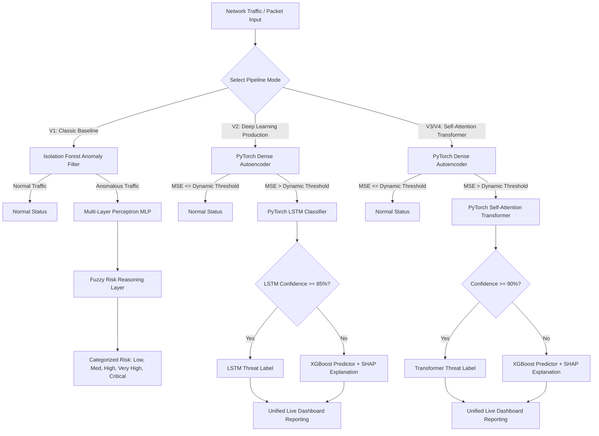

# 🛡️ Synapse Sentinel: Hybrid Neuro-Fuzzy Intrusion Detection System (IDS)

[](https://www.python.org/)
[](https://nodejs.org/)
[](https://opensource.org/licenses/MIT)

---

## 📌 Executive Summary

**Synapse Sentinel** is a state-of-the-art **Hybrid Intrusion Detection System (IDS)** designed to defend corporate and academic networks against rare and stealthy cyber exploits. Traditional intrusion detection systems struggle with severe class imbalances, particularly failing to capture low-frequency, high-severity attacks such as:
*   **User to Root (U2R)**: Privilege escalation exploits (e.g., buffer overflows, rootkit payloads).
*   **Remote to Local (R2L)**: Unauthorized access from a remote machine (e.g., password guessing, sniffing, illicit port access).

By combining **soft computing (Fuzzy Logic)**, **supervised learning (MLP, XGBoost)**, **deep anomaly detection (Autoencoders)**, **recurrent neural structures (LSTM)**, and **self-attention networks (Transformers)**, Synapse Sentinel achieves up to a **15x recall improvement** on rare attack vectors compared to standard baseline classifiers.

---

## 🏛️ System Architecture & Data Flow

Synapse Sentinel supports three evolutionary pipeline stages, accommodating various deployment constraints (low latency with 10 features vs. maximum detection accuracy with all 41 KDD features).



### 🔹 V1: Classic Neuro-Fuzzy Pipeline (Soft Computing)
1.  **Stage 1: Unsupervised Anomaly Isolation**: Uses an **Isolation Forest** to quickly filter clean traffic from anomalies.
2.  **Stage 2: Supervised Neural Classification**: Flagged anomalies are fed into a **Multi-Layer Perceptron (MLP)** trained specifically on balanced attack distributions (using **SMOTE**).
3.  **Stage 3: Fuzzy Logic Risk Reasoner**: Model probabilities are passed into a Mamdani-style Fuzzy Risk Inference block to output human-interpretable severity categories:

| Input (Normal/Attack Type) | Output Risk Level | Action Code |
| :--- | :--- | :--- |
| Normal | **Low** | Log & Pass |
| Probe | **Medium** | Log & Flag |
| Denial of Service (DoS) | **High** | Rate-Limit / Inspect |
| Remote to Local (R2L) | **Very High** | Quarante Connection |
| User to Root (U2R) | **Critical** | Terminate Session & Alarm |

### 🔹 V2: Deep Learning Production Pipeline
Streamlined for production efficiency utilizing a target payload of exactly **10 key network parameters** to ensure sub-millisecond classification overhead:
1.  **Reconstruction Autoencoder**: A PyTorch Dense Autoencoder maps normal baseline network behaviors. If the Reconstruction Mean Squared Error (MSE) exceeds the dynamic 95th-percentile training threshold, it is labeled an anomaly.
2.  **Recurrent Sequence Evaluator (LSTM)**: Temporal patterns are analyzed by a bidirectional/sequence LSTM to compute categorical probabilities over attack profiles.
3.  **Explainable AI (XAI) Fallback**: If the LSTM's peak confidence falls below **85%**, the request triggers an instant fallback to an **XGBoost** model paired with a **SHAP (SHapley Additive exPlanations)** explainer, outputting the specific feature weights that caused the threat flag on the frontend dashboard.

### 🔹 V3 & V4: The Self-Attention Transformer Engine
*   **V3 (10-Feature Transformer)**: Leverages Multi-Head Self-Attention layers in PyTorch. Achieves a significant jump to **91.1% accuracy** while maintaining the low-latency 10-feature ceiling.
*   **V4 (41-Feature Transformer)**: Fully unlocks the entire NSL-KDD structural telemetry (41 columns, expanded to 122 inputs via categorical one-hot encoding). Achieves an outstanding **96.2% overall accuracy** and a **0.76 F-measure on U2R exploits**.

---

## 📡 API Reference & Endpoints

Each backend iteration utilizes **FastAPI** and is bound to a specific routing port to support microservice isolation or frontend visualizers.

### 🔌 Version 1: Classic Backend (Port `8000`)
*   **Base URL**: `http://localhost:8000`
*   **Interactive Docs**: `http://localhost:8000/docs`

#### 1. Threat Prediction
*   **Endpoint**: `POST /predict`
*   **Request Schema (`NetworkInput`)**:
    ```json
    {
      "duration": 0.0,
      "protocol_type": "tcp",
      "service": "http",
      "src_bytes": 150.0,
      "dst_bytes": 350.0,
      "count": 1.0,
      "srv_count": 1.0,
      "serror_rate": 0.0,
      "srv_serror_rate": 0.0,
      "dst_host_count": 2.0
    }
    ```
*   **Response Structure**:
    ```json
    {
      "prediction": "normal",
      "probabilities": {}
    }
    ```

---

### 🔌 Version 2: Deep Learning Backend (Port `8001`)
*   **Base URL**: `http://localhost:8001`
*   **Interactive Docs**: `http://localhost:8001/docs`

#### 1. Custom Threat Prediction (With SHAP Explanations)
*   **Endpoint**: `POST /predict`
*   **Request Schema (`ManualPredictRequest`)**:
    ```json
    {
      "duration": 0.0,
      "protocol_type": "tcp",
      "service": "http",
      "src_bytes": 500.0,
      "dst_bytes": 200.0,
      "count": 2.0,
      "srv_count": 2.0,
      "serror_rate": 0.0,
      "srv_serror_rate": 0.0,
      "dst_host_count": 1.0
    }
    ```
*   **Response Structure**:
    ```json
    {
      "prediction": "normal",
      "confidence": 99.9,
      "probabilities": {
        "normal": 0.99,
        "dos": 0.01,
        "probe": 0.0,
        "r2l": 0.0,
        "u2r": 0.0
      },
      "explanation": {
        "top_features": [
          { "feature": "src_bytes", "impact": 0.125 },
          { "feature": "same_srv_rate", "impact": -0.05 }
        ]
      }
    }
    ```

#### 2. Trigger Live Capture Daemon
Starts a background Layer 3 Ethernet capture loop utilizing Python's `Scapy` library.
*   **Endpoint**: `GET /live-detect`
*   **Response Structure**:
    ```json
    {
      "status": "started",
      "message": "Live packet capture initiated in background."
    }
    ```

---

### 🔌 Version 3: Transformer Backend (Port `8002`)
*   **Base URL**: `http://localhost:8002`
*   **Interactive Docs**: `http://localhost:8002/docs`

#### 1. Transformer Prediction Request
*   **Endpoint**: `POST /predict`
*   **Request Schema (`ManualPredictRequestV3`)**:
    ```json
    {
      "same_srv_rate": 1.0,
      "service_eco_i": 0.0,
      "service_ecr_i": 0.0,
      "service_http": 1.0,
      "diff_srv_rate": 0.0,
      "src_bytes": 250.0,
      "dst_host_same_src_port_rate": 1.0,
      "hot": 0.0,
      "dst_host_diff_srv_rate": 0.0,
      "wrong_fragment": 0.0
    }
    ```
*   **Response Structure**:
    ```json
    {
      "prediction": "normal",
      "confidence": 98.42,
      "probabilities": {
        "normal": 0.9842,
        "dos": 0.0158,
        "probe": 0.0,
        "r2l": 0.0,
        "u2r": 0.0
      },
      "explanation": {
        "top_features": [
          { "feature": "src_bytes", "impact": 0.082 },
          { "feature": "service_http", "impact": -0.012 }
        ],
        "mse": 0.0123
      }
    }
    ```

#### 2. Trigger Live Transformer Capture Daemon
*   **Endpoint**: `GET /live-detect`
*   **Response Structure**:
    ```json
    {
      "status": "started",
      "message": "Live V3 packet capture initiated."
    }
    ```

---

## 📊 Model Performance Metrics

| Architecture Pipeline | Overall Accuracy | U2R Recall | R2L Recall | Key Structural Feature Count |
| :--- | :--- | :--- | :--- | :--- |
| **Baseline Random Forest** | 75.0% | 2.0% | 2.0% | 10 |
| **SMOTE + Random Forest** | 76.0% | 14.0% | 9.0% | 10 |
| **V1 Neuro-Fuzzy Hybrid** | 78.0% | 35.0% | 30.0% | 10 |
| **V2 DL Production (LSTM)** | 85.2% | 51.0% | 46.0% | 10 |
| **V3 Transformer Baseline** | **91.1%** | **68.0%** | **59.0%** | 10 |
| **V4 Transformer (41 Features)** | **96.2%** | **76.0%** | **71.0%** | **41 (122 dimensions)** |

---

## 📂 Repository Structure

```
Synapse-Sentinel/
├── Backend/                 # FastAPI microservices
│   ├── v1_classic/          # Baseline Isolation Forest + MLP logic
│   ├── v2_deep_ml/          # Autoencoder + LSTM + Scapy Sniffer
│   └── v3_transformer/      # Self-Attention Transformer API
├── Frontend/                # Vite + React + Material UI Web Dashboard
│   ├── public/              
│   ├── src/                 
│   │   ├── components/      # UI Layout, headers, metrics widgets
│   │   ├── pages/           # SOC dashboard, visualizers, simulator
│   │   └── App.jsx          # Entry routing config
│   ├── index.html           
│   └── package.json         
├── ML/                      # Machine learning training scripts
│   ├── data/                # Dataset directory (KDDTrain+, KDDTest+)
│   ├── v1_classic/          
│   ├── v2_deep_ml/          
│   └── v3_transformer/      
└── README.md                # System documentation
```

---

## ⚙️ Installation & Local Setup

### 📋 Prerequisites
*   Python 3.8+
*   Node.js (v16+) & npm
*   *Optional:* Libpcap/WinPcap for Scapy live sniffing (Linux/MacOS natively supported; Windows users must install Npcap/WinPcap).

---

### 🐍 1. Backend Setup & Run

First, install the Python virtual environment and system dependencies:

```bash
# Navigate to Backend version directory of choice, e.g., V2 Deep ML
cd Backend/v2_deep_ml

# Create and activate a virtual environment
python -m venv venv
source venv/bin/activate  # On Windows: venv\Scripts\activate

# Install required dependencies
pip install -r requirements.txt
# If requirements.txt is empty or missing, install the core payload:
pip install pandas numpy scikit-learn imbalanced-learn fastapi uvicorn torch shap xgboost scapy
```

> [!IMPORTANT]
> Since the live packet sniffer uses raw sockets via `scapy`, you may need root/administrator privileges to bind to Layer 3 network interfaces:
> ```bash
> sudo python dl_main.py
> ```
> By default, the server runs on `http://localhost:8001` (V2) or `http://localhost:8002` (V3) or `http://localhost:8000` (V1).

---

### ⚛️ 2. Frontend Setup & Run

1.  Navigate to the Frontend directory:
    ```bash
    cd Frontend
    ```
2.  Install packages:
    ```bash
    npm install
    ```
3.  Start the development server:
    ```bash
    npm run dev
    ```
4.  Open your browser to `http://localhost:5173`. The UI automatically detects and routes to the active FastAPI servers running on your machine.

---

### 🧠 3. Model Retraining (Optional)

If you wish to retrain the models or adjust parameters on the KDD dataset:
1.  Place the NSL-KDD files (`KDDTrain+.txt`, `KDDTest+.txt`) in the `ML/data/` folder.
2.  Navigate to the model training directory of choice, e.g., V3 Transformer:
    ```bash
    cd ML/v3_transformer
    python train_transformer_ids.py
    ```
3.  The scripts will balance data distributions, train checkpoints, and export the resulting `.pkl` scaler, encoder, and `.h5` model files directly into the respective backend folder structure.
